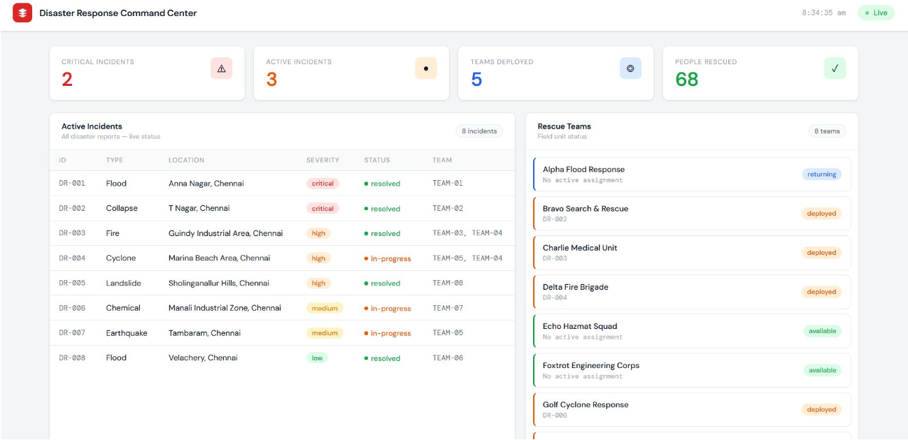
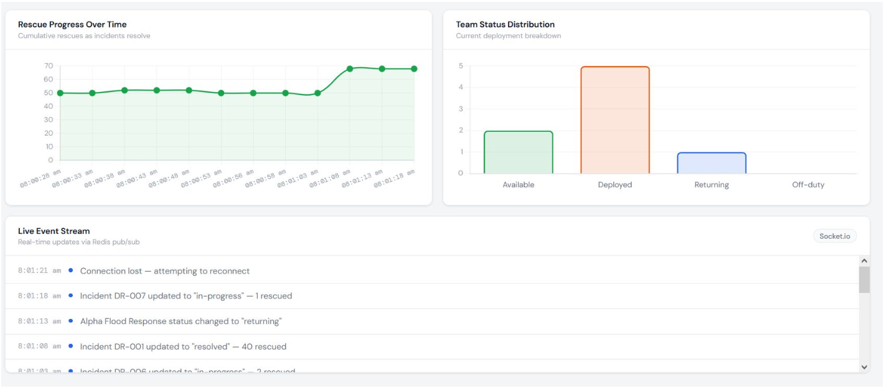

# Disaster Management Dashboard

A real-time disaster response system that monitors incidents, manages rescue teams, and streams live updates using NoSQL technologies.

---

## 📸 Dashboard Preview

### Main Dashboard

### Live Updates & Charts

---

# Overview

This project is a real-time Disaster Response Command Center designed to monitor and manage disaster situations efficiently. It provides a centralized system where incidents, rescue teams, and live updates are tracked in one place.

The system uses CouchDB (NoSQL) to handle dynamic and unstructured disaster data, along with Redis for caching and real-time event streaming. A web-based dashboard visualizes live updates, statistics, and insights through charts.

The goal is to simulate how modern disaster management systems operate using scalable, real-time technologies.

# Problem Statement

In disaster scenarios, information is often scattered across multiple sources, leading to slow coordination and delayed decision-making.

Traditional systems struggle with:

Handling rapidly changing data
Providing real-time updates
Scaling during large disasters
Coordinating multiple teams and incidents

This project addresses these challenges by creating a centralized, real-time system for tracking incidents, managing teams, and streaming updates instantly.

# Key Features
Live dashboard displaying ongoing disaster incidents
Incident tracking with severity, status, and location
Real-time rescue team monitoring and assignment
Flexible NoSQL data model using CouchDB
Redis caching for improved performance
Real-time updates using Redis Pub/Sub + Socket.io

# Dashboard Capabilities
Live statistics (active incidents, deployed teams, rescued people)
Dynamic incident table with real-time updates
Rescue team tracking and assignment details
Charts for rescue progress and team distribution
Live event feed showing system activity

# Demonstration Flow
Database is seeded with predefined incidents and teams
Backend server loads and serves data to the dashboard
Simulation script generates real-time updates:
Incident status changes (active → in-progress → resolved)
Team assignments and availability updates
Rescue count updates
Updates are published via Redis and pushed using Socket.io
Dashboard reflects changes instantly:
Updated tables
Live charts
Event logs

# Results
Real-time disaster monitoring with accurate updates
Efficient handling of dynamic data using CouchDB
Reduced latency through Redis caching
Instant communication via Pub/Sub
Clear visualization of rescue operations

# Conclusion

This project demonstrates how modern technologies can be used to build a scalable, real-time disaster management system.

CouchDB enables flexible data modeling, while Redis enhances performance and enables real-time communication. Together with APIs and live updates, the system closely simulates real-world disaster response workflows.

# Tech Stack
Frontend: HTML, CSS, JavaScript
Backend: Node.js / Python
Database: CouchDB (NoSQL)
Caching & Messaging: Redis
Realtime Communication: Socket.io
Charts: Chart.js

 Setup Instructions
# Install dependencies
npm install

# Start CouchDB
http://localhost:5984

# Start Redis
redis-server

# Seed database
node seed.js

# Start server
node server.js

# Run simulation
node simulate.js

# DevOps Note

This repository includes minor commits (like pipeline test changes) used to validate CI/CD workflows.