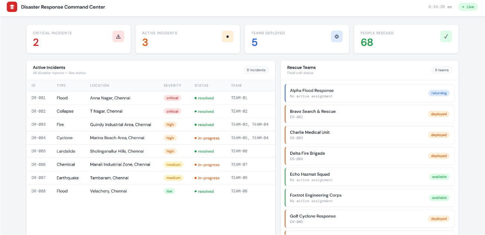
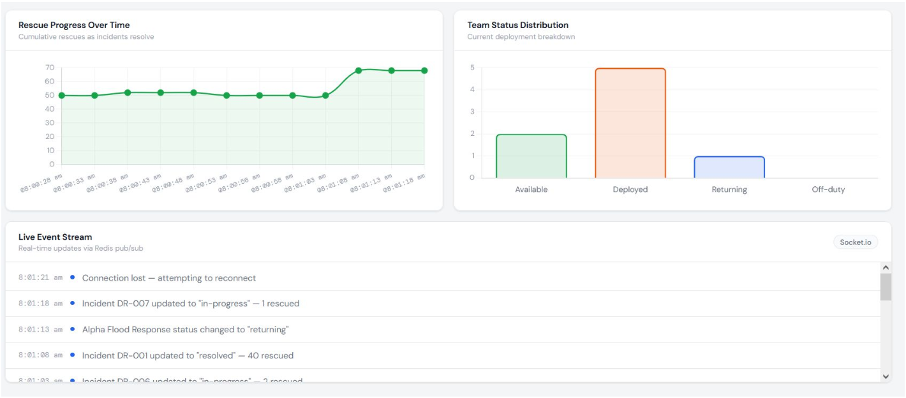

# Disaster Management Dashboard

A real-time disaster response system that monitors incidents, manages rescue teams, and streams live updates using NoSQL technologies.

---

## 📸 Dashboard Preview

### Main Dashboard


### Live Updates & Charts


---

# Overview

This project is a real-time Disaster Response Command Center designed to monitor and manage disaster situations efficiently. It provides a centralized system where incidents, rescue teams, and live updates are tracked in one place.

The system uses CouchDB (NoSQL) to handle dynamic and unstructured disaster data, along with Redis for caching and real-time event streaming. A web-based dashboard visualizes live updates, statistics, and insights through charts.

The goal is to simulate how modern disaster management systems operate using scalable, real-time technologies.

# Problem Statement

In disaster scenarios, information is often scattered across multiple sources, leading to slow coordination and delayed decision-making.

Traditional systems struggle with:

Handling rapidly changing data
Providing real-time updates
Scaling during large disasters
Coordinating multiple teams and incidents

This project addresses these challenges by creating a centralized, real-time system for tracking incidents, managing teams, and streaming updates instantly.

# Key Features
Live dashboard displaying ongoing disaster incidents
Incident tracking with severity, status, and location
Real-time rescue team monitoring and assignment
Flexible NoSQL data model using CouchDB
Redis caching for improved performance
Real-time updates using Redis Pub/Sub + Socket.io

# Dashboard Capabilities
Live statistics (active incidents, deployed teams, rescued people)
Dynamic incident table with real-time updates
Rescue team tracking and assignment details
Charts for rescue progress and team distribution
Live event feed showing system activity

# Demonstration Flow
Database is seeded with predefined incidents and teams
Backend server loads and serves data to the dashboard
Simulation script generates real-time updates:
Incident status changes (active → in-progress → resolved)
Team assignments and availability updates
Rescue count updates
Updates are published via Redis and pushed using Socket.io
Dashboard reflects changes instantly:
Updated tables
Live charts
Event logs

# Results
Real-time disaster monitoring with accurate updates
Efficient handling of dynamic data using CouchDB
Reduced latency through Redis caching
Instant communication via Pub/Sub
Clear visualization of rescue operations

# Conclusion

This project demonstrates how modern technologies can be used to build a scalable, real-time disaster management system.

CouchDB enables flexible data modeling, while Redis enhances performance and enables real-time communication. Together with APIs and live updates, the system closely simulates real-world disaster response workflows.

# Tech Stack
Frontend: React + Vite, Recharts, Leaflet
Backend: Node.js (Express 5), Socket.io
Database: CouchDB (NoSQL) — Mango queries + design-doc views
Caching & Messaging: Redis (Streams event log + sorted-set leaderboard)
Realtime Communication: Socket.io over Redis
DevOps: Docker + Docker Compose, Jenkins (Configuration-as-Code)

---

# Quick Start (containerized)

The whole stack is containerized — you only need Docker Desktop.

```bash
# Bring up CouchDB + Redis + backend + frontend (auto-seeds, waits for health)
docker compose up -d --wait

# Optional: also start the live data simulator
docker compose --profile sim up -d

# Open the dashboard
http://localhost:3001
```

`docker compose down -v` tears it all down.

---

# CI/CD Pipeline (Jenkins)

A full Jenkins pipeline runs inside Docker and builds, tests, deploys, and
monitors the app. Jenkins is provisioned automatically via **Configuration as
Code** + **Job DSL** — no manual UI setup.

### Run it

```bash
# Build & start the Jenkins controller (Docker CLI + Compose baked in)
docker compose -f jenkins.compose.yml up -d --build

# Open Jenkins and run the "disaster-dashboard" job
http://localhost:8080          # login: admin / admin
```

The job clones this repo from GitHub (`main`) and runs `Jenkinsfile`.

### Pipeline stages

| Stage | What it does |
|-------|--------------|
| **Checkout** | Clones the repo from GitHub. |
| **Lint** | ESLint on the frontend (runs in the test image). |
| **Test** | Spins up throwaway CouchDB + Redis, runs backend integration tests (node:test + supertest) and frontend unit tests (vitest), then tears the test stack down. |
| **Build** | Multi-stage Docker build: compiles the React app and bakes it into the API image. |
| **Deploy** | `docker compose up -d --wait` — recreates the live stack; healthchecks gate readiness, seed runs idempotently. |
| **Monitor** | Reports the health of every running service and verifies the `/api/health` endpoint from inside the container network. |

### Architecture

- **`Dockerfile`** — multi-stage: `frontend-build` → `runtime` (API serving the built SPA), plus `test` / `frontend-test` targets.
- **`docker-compose.yml`** — the production app stack (CouchDB, Redis, seed, backend, optional simulator) with healthchecks and dependency ordering.
- **`docker-compose.test.yml`** — ephemeral, volume-less databases + test runners for CI.
- **`jenkins.Dockerfile` / `jenkins.compose.yml`** — Jenkins-in-Docker with the Docker CLI; runs sibling containers via the mounted host socket.
- **`jenkins/casc.yaml`** — Configuration-as-Code: admin login + auto-created pipeline job.

---

# Manual Setup (without Docker)

```bash
npm install          # in backend/ and dmd-frontend/
node seed.js         # seed CouchDB (running on :5984)
node server.js       # start API
node simulate.js     # optional: live updates
```